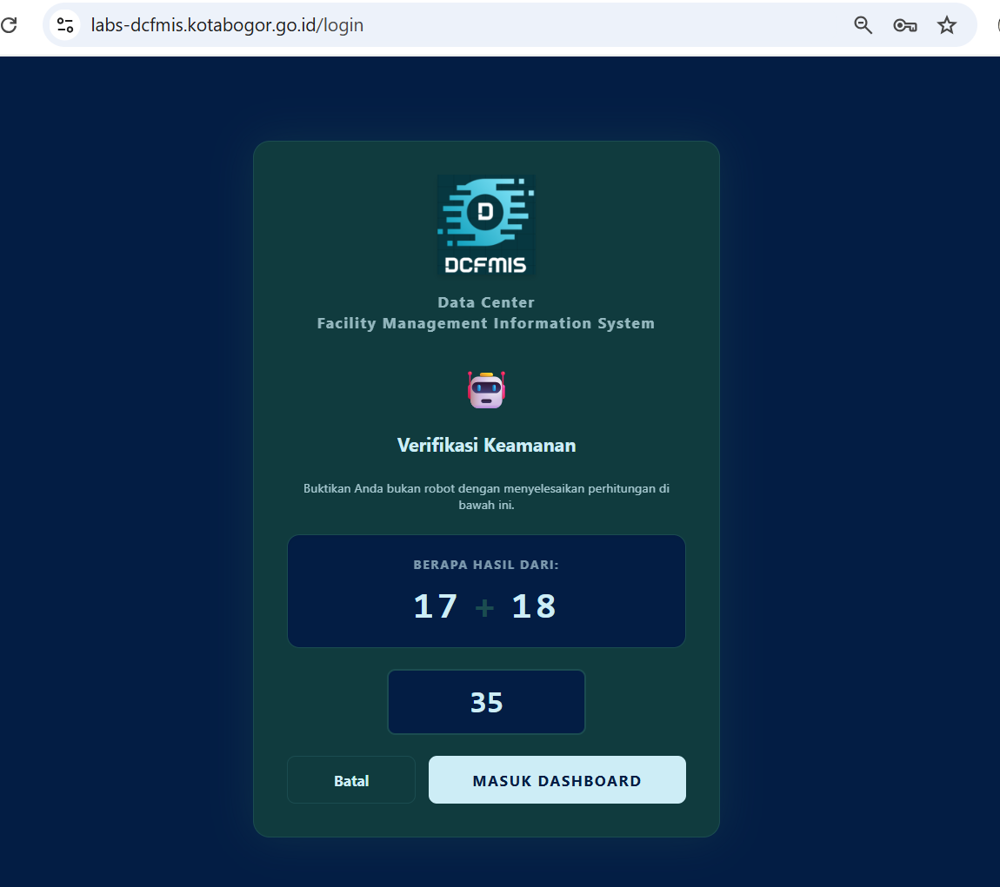
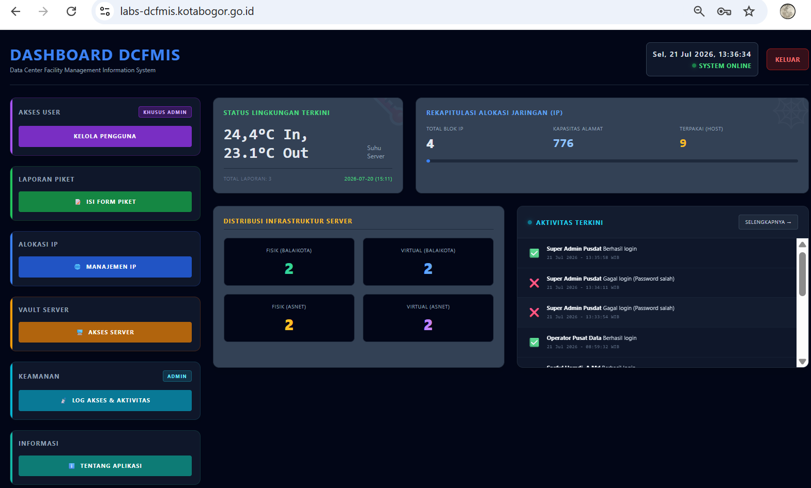
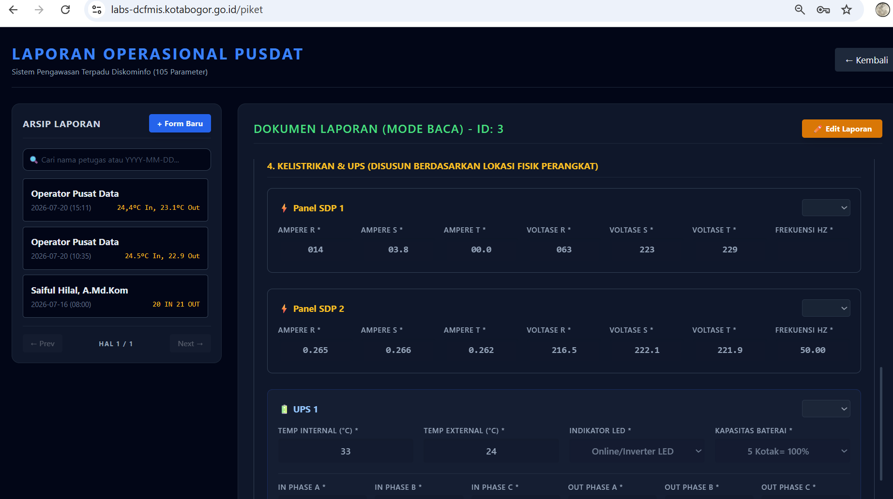
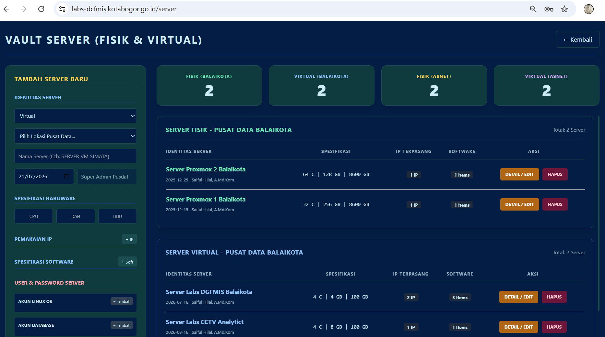
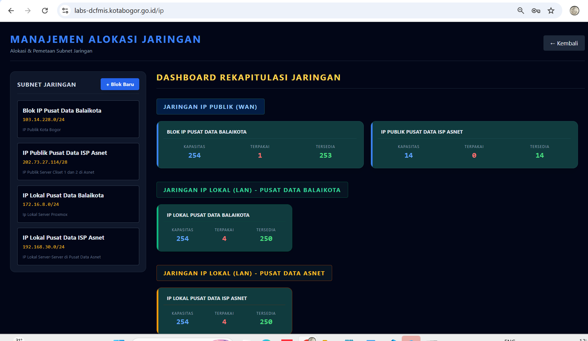
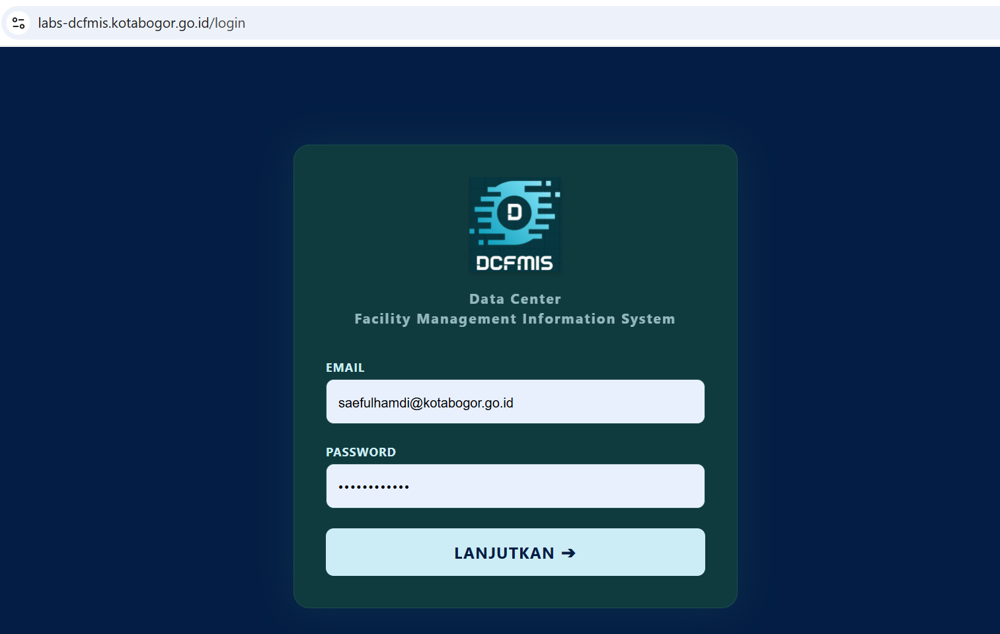

# 🖥️ Data Center Facility Management Information System (DCFMIS)


---

## 📖 Tentang Aplikasi

Data Center Facility Management Information System (DCFMIS) merupakan aplikasi yang dikembangkan untuk membantu pengelolaan operasional Pusat Data secara terintegrasi.

Aplikasi digunakan oleh Tim Pusat Data untuk melakukan monitoring, pencatatan, dan pengelolaan fasilitas pusat data secara rutin sehingga seluruh aktivitas operasional dapat terdokumentasi dengan baik.

---

## ✨ Fitur Utama

### 👥 Manajemen Pengguna

- Super Admin
- Admin
- Eksekutif

Hak akses setiap level berbeda sesuai kewenangan masing-masing.

---

### 🏢 Piket Fasilitas Pusat Data

Melakukan pencatatan kondisi:

- Suhu ruang server
- CCTV
- PC Operator
- AC
- UPS
- Panel Listrik
- Rack Server
- Catatan Harian

---

### 🖥️ Manajemen Server

Menyimpan informasi:

- Hardware Server
- Software
- Sistem Operasi
- Lokasi
- Rack
- IP Address
- Port
- Status Server

---

### 🌐 Manajemen IP

Mengelola:

- IP Public
- IP Lokal
- Alokasi IP
- Status penggunaan

---

# 🏗️ Arsitektur Sistem

DCFMIS terdiri dari tiga aplikasi utama.

```text
                    +----------------+
                    | Flutter Mobile |
                    +--------+-------+
                             |
                             |
                             |
+----------------+     REST API     +----------------------+
| Nuxt Dashboard | <--------------> |      Golang API      |
+----------------+                  +----------+-----------+
                                               |
                                               |
                                         +-----+------+
                                         |   MySQL    |
                                         +------------+
```

---

# ⚙️ Teknologi

| Komponen | Teknologi |
|----------|------------|
| Backend API | Golang 1.25.1 |
<<<<<<< HEAD
=======
| Framework | Gin |
| ORM | GORM |
>>>>>>> ccc2a7349ee3d15d1921ce0c324db03bff92d0c4
| Database | MySQL 8.0.45 |
| Dashboard | Nuxt 4 |
| Frontend | Vue 3 |
| Mobile | Flutter |
<<<<<<< HEAD
=======
| Authentication | JWT |
>>>>>>> ccc2a7349ee3d15d1921ce0c324db03bff92d0c4
| Server | Ubuntu 24.04 LTS |

---

# 📂 Struktur Folder

```text
DCFMIS/
│
├── README.md
├── LICENSE
├── docs/
<<<<<<< HEAD
│   └── images/
│
├── api/
│   ├── config/
│   |   └── database.go
│   ├── handlers/
│   |   ├── auth_handler.go
│   |   ├── crypto_utils.go
│   |   ├── ip_handler.go
│   |   ├── log_handler.go
│   |   ├── piket_handler.go
│   |   ├── server_handler.go
│   |   └── user_handler.go
│   ├── models/
│   |   └── piket.go
│   ├── main.go
=======
│   ├── images/
│   ├── api.md
│   ├── deployment.md
│   └── database.md
│
├── golang-api/
│   ├── cmd/
│   ├── config/
│   ├── handlers/
│   ├── middleware/
│   ├── models/
│   ├── routes/
>>>>>>> ccc2a7349ee3d15d1921ce0c324db03bff92d0c4
│   ├── go.mod
│   └── go.sum
│
├── dashboard/
<<<<<<< HEAD
│   ├── app/
│   |   ├── middleware/
│   |   |   └── auth.ts
│   |   ├── pages/
│   |   |   ├── ip/
│   |   |   |   └── index.vue
│   |   |   ├── log-akses/
│   |   |   |   └── index.vue
│   |   |   ├── piket/
│   |   |   |   └── index.vue
│   |   |   ├── server/
│   |   |   |   └── index.vue
│   |   |   ├── users/
│   |   |   |    └── index.vue
│   |   |   ├── index.vue
│   |   |   └── login.json
│   |   └── app.vue
    ├── plugins/
│   |   └── api.js    
│   └── public/
│
└── mobile/
    ├── android/
    ├── assets/    
    ├── ios/
    ├── lib/
    |   ├── screens/
    |   |   ├── dashboard_screen.dart 
    |   |   ├── ip_screen.dart  
    |   |   ├── login_screen.dart  
    |   |   ├── piket_detail_screen.dart  
    |   |   ├── piket_input_screen.dart 
    |   |   ├── piket_screen.dart  
    |   |   ├── server_screen.dart                                                   
    |   |   └── splash_screen.dart
    |   └── main.dart
    └── pubspec.yaml
```
=======
│   ├── assets/
│   ├── components/
│   ├── composables/
│   ├── pages/
│   ├── public/
│   ├── app.vue
│   └── package.json
│
└── mobile/
    ├── android/
    ├── ios/
    ├── lib/
    ├── assets/
    └── pubspec.yaml
```

>>>>>>> ccc2a7349ee3d15d1921ce0c324db03bff92d0c4
---

# 🔐 Keamanan

Implementasi keamanan pada aplikasi meliputi:

<<<<<<< HEAD
- 2 Step Authentication
=======
- JWT Authentication
>>>>>>> ccc2a7349ee3d15d1921ce0c324db03bff92d0c4
- Role Based Access Control (RBAC)
- AES Encryption untuk data sensitif
- Password Hashing (bcrypt)
- API hanya dapat diakses Dashboard dan Mobile
- HTTPS/TLS
- Audit Log

Data yang dienkripsi:

- Nama Lengkap
- Email
- Password
- IP Server
- Port
- Nama Server
- Nama Pusat Data
- Software
- Credential Server

---

# 🚀 Instalasi

## Backend

```bash
<<<<<<< HEAD
cd api
=======
cd golang-api
>>>>>>> ccc2a7349ee3d15d1921ce0c324db03bff92d0c4
go mod tidy
go run .
```

---

## Dashboard

```bash
cd dashboard
npm install
npm run dev
```

---

## Flutter

```bash
cd mobile
flutter pub get
flutter run
```

---

# 📷 Screenshot

### Dashboard Login


<<<<<<< HEAD


### Dashboard Utama dan Modul-modul;






### Mobile




=======

### Dashboard Utama


### Mobile


>>>>>>> ccc2a7349ee3d15d1921ce0c324db03bff92d0c4

---

# 🌐 Demo

URL

```
https://labs-dcfmis.kotabogor.go.id
```

Demo Account

| Level | User |
|--------|------|
| Admin | demo_admin@gmail.com |
| Eksekutif | demo_eksekutif@gmail.com |

Password

```
Demo12345!
```

---

# 📅 Roadmap

- [x] Authentication
- [x] User Management
- [x] Monitoring Server
- [x] Data Center Checklist
<<<<<<< HEAD
- [ ] Reset Password
- [ ] CCTV Monitoring
- [ ] Backup Management
- [ ] Report
=======
- [ ] Notification WA
- [ ] Monitoring SNMP
- [ ] Grafana Integration
- [ ] Backup Management
>>>>>>> ccc2a7349ee3d15d1921ce0c324db03bff92d0c4

---

# 👨‍💻 Pengembang

**Saeful Hamdi**
<<<<<<< HEAD
📧 shamdi.rh@gmail.com

---
=======

Pranata Komputer Mahir  
Dinas Komunikasi dan Informatika Kota Bogor

📧 shamdi.rh@gmail.com

---
>>>>>>> ccc2a7349ee3d15d1921ce0c324db03bff92d0c4
